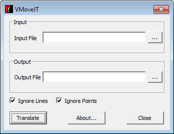

GUI Layout
===========

VMoveJT GUI can be invoked from Start | Programs | VCollab | VMoveJT. The following diagram describes it's layout.

|image1|

========================= =========================================================================
**Input File**                 Allows user to select the input JT file

**Output File**                Allows user to select output CAX file

**Ignore Lines**               Helps user to ignore the line elements

**Ignore Points**              Helps user to ignore the point elements

**Translate**                  Starts conversion.

**About...**                   Pops up VMoveJT version information.

**Close**                      Closes the window.
 
========================= =========================================================================

