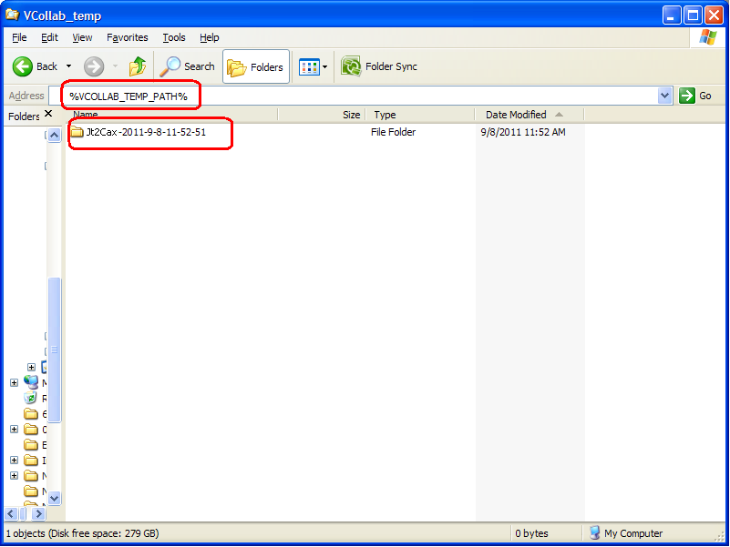
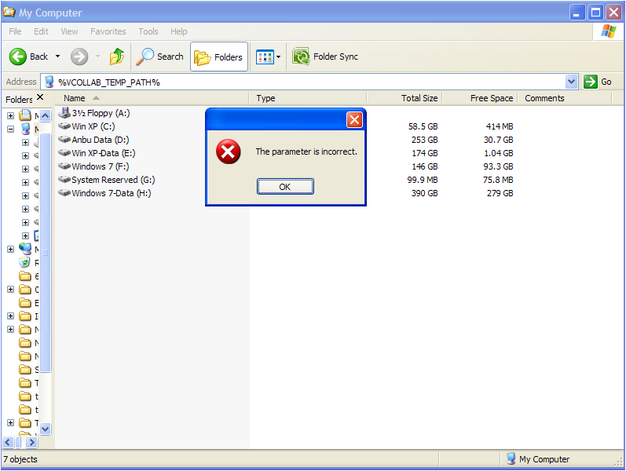
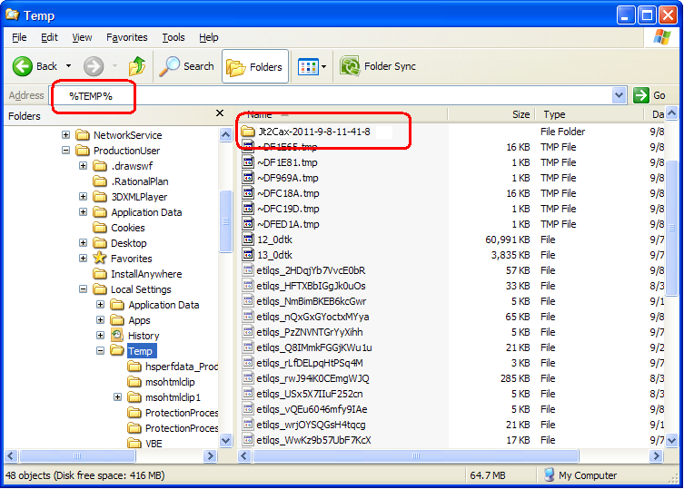

Log Files
===========

VMoveJT generates log file during each translation.  User can find the following log file after each VMoveJT run.

   - VMoveJT_Log.txt

The above file is written in a folder of the following format

    VMoveJT-YYYY-MM-DD-HH-MM-SS

That is, VMoveJT  creates a folder in the above format for each instance of Jt2Cax application and writes the log file into the folder.

The folder with log files is generally written into a folder represented by VCOLLAB_TEMP_PATH environment variable.  User can go to this folder by just entering %VCOLLAB_TEMP_PATH% in the windows explorer address bar as shown in the following figure.

|image1|

If the VCOLLAB_TEMP_PATH environment variable is not defined, user will get an error message similar to the one shown in the following figure.

|image2|

In case of non-existence of VCOLLAB_TEMP_PATH, the log file folder is written into a folder represented by the Windows environment variable TEMP. User can go to this folder by entering %TEMP% in the Windows explorer address bar as shown in the following figure.

|image3|

In case of errors during the VMoveJT usage, the users are requested to communicate the errors along with these log files generated by VMoveJT to VCollab support (support@vcollab.com).  The log files are designed to help the VCollab development and support teams understand the issues better and faster and provide fixes or workarounds to the user.  

